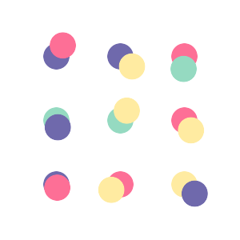
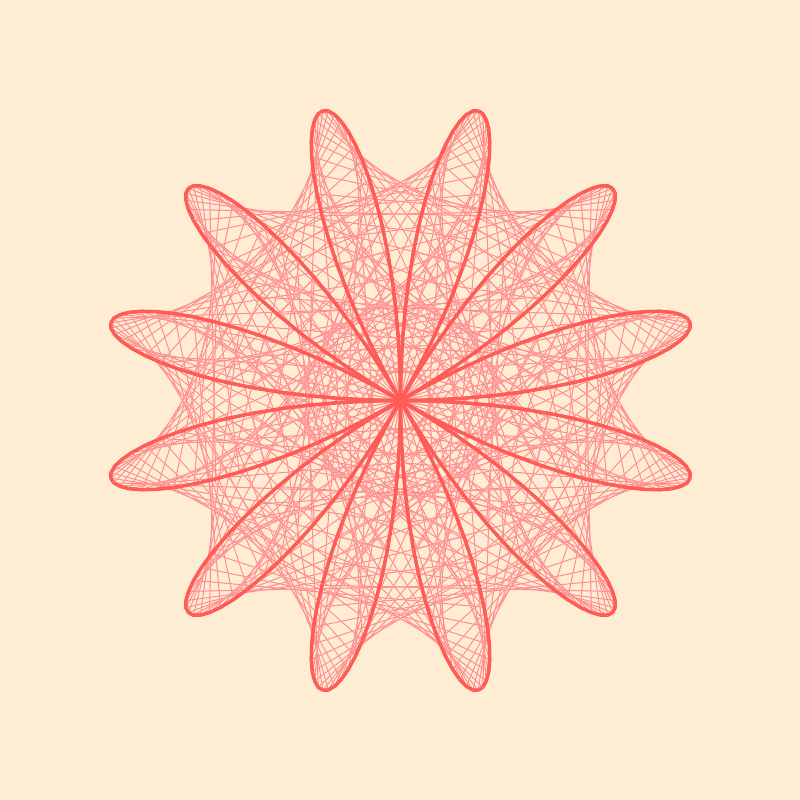
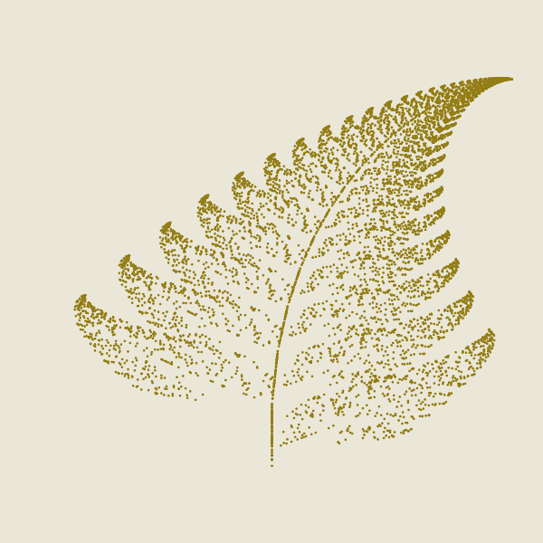
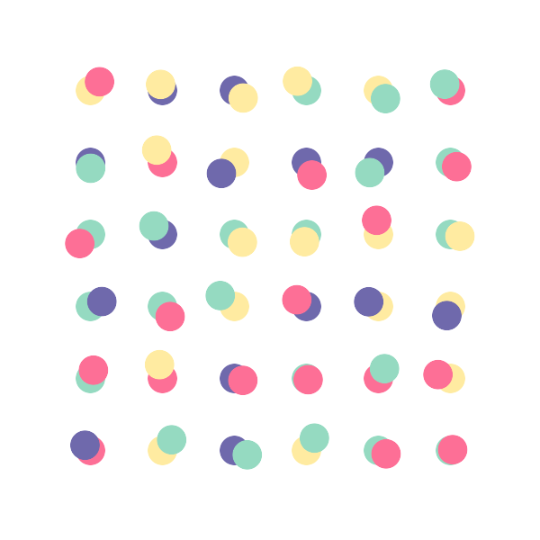

# Sketch



A library for creating generative art with Elixir. Sketch only supports generating static images (There's only so much one can achieve in 48h, hopefully ther will be animation in the future)

## Example Art

### Maurer Rose

Generated with `Examples.maurer_rose(6, 71) |> Sketch.save()`. Have a look at the [Wikipedia article](https://en.wikipedia.org/wiki/Maurer_rose) for more information about the Maurer rose, and for more values to try!



### Barnsley Fern

Generated with `Examples.barnsley_fern(7000) |> Sketch.save()`. Have a look at the [Wikipedia article](https://en.wikipedia.org/wiki/Barnsley_fern) for more information about the Barnsley Fern

This one would look even cooler with higher detail, but I hit the limit of what `Mogrify` could deal with. Optimizations to come after Spawnfest I'm afraid!



### Other

Generated with `Examples.candy_dots(6) |> Sketch.save()`



## Usage

Currently Sketch is not yet available on Hex, but to give it a try you can install it directly from this repo.

```elixir
def deps do
  [
    {:sketch, git: "https://github.com/spawnfest/toe-BEAMS.git", branch: "main"}
  ]
end
```

### Usage Examples

One of the main aims of Sketch is to be easy and intuitive to use, so basic usage is fairly simple: Create a `%Sketch{}` struct with `Sketch.new()`, and use any of the other functions to add or change things about your sketch. Since all functions in the
main `Sketch` module take a `%Sketch{}` as the first argument and return a `%Sketch{}`, you can easily pipe everything together.

Once you've built your final `Sketch`, you can call `Sketch.run(sketch)` to render it on screen (using `wxWidgets`), or `Sketch.save(sketch)` to save it as a `png`. (Note: saving to PNG requires you to have [ImageMagick](https://imagemagick.org/script/download.php) installed on your machine)

### Known Issues

There is currently some weirdness that the `:wx` window does not always paint on first load. It will generally work if you close and rerun the sketch - Unfortunately I've not been able to get to the bottom of that in the time limit.

In addition, I unfortunately only had access to a MacBook this weekend. I am not aware of
any reasons why things _shouldn't_ work as expected on other operating systems, but figured I'd mention it just in case...

```elixir
Sketch.new()
|> Sketch.set_fill({100, 100, 100})
|> Sketch.square(%{origin: {0, 0}, size: 50})
|> Sketch.run()
```

This will draw a medium gray square with its top left corner at x 0, y 0 and a width and height of 50.

To add more shapes to the canvas, just keep piping:

```elixir
Sketch.new()
|> Sketch.square(%{origin: {0, 0}, size: 50})
|> Sketch.rect(%{origin: {0, 0}, width: 10, height: 20})
|> Sketch.line(%{start: {0, 0}, finish: {50, 50}})
|> Sketch.save()
```

Any fill, stroke or transforms applied to the sketch will apply to anything added after, and will stack with any applied before them. You can use `Sketch.reset_matrix/1` to remove all transforms applied up until that point. A future goal is to allow overrides on specific primitives, but that is beyond the scope of a weekend.

```elixir
Sketch.new()
|> Sketch.translate({20, 20})
# This next square will be drawn at {20,20} from the top left
|> Sketch.square(%{origin: {0, 0}, size: 50})
|> Sketch.translate({10, 10})
# This next square will be drawn at {30,30} from the top left
|> Sketch.square(%{origin: {0, 0}, size: 50})
|> Sketch.reset_matrix()
# This next square will be drawn at {0,0} from the top left
|> Sketch.square(%{origin: {0, 0}, size: 50})
|> Sketch.save()
```

## Features

A brief overview of features that are available so far, and ones that you might expect from a drawing library, that are not yet implemented.

### General

- [x] Sketch size
- [x] Sketch title
- [x] Sketch background colour
- [ ] Specify png save location

### Primitives

- [x] Line
- [x] Rectangle
- [x] Square
- [x] Ellipse
- [x] Circle
- [x] Point
- [ ] Triangle
- [ ] Arc
- [ ] Quad
- [ ] Path (for more complex lines)

## Transforms

- [x] Translate
- [x] Rotate
- [x] Scale
- [x] Reset all transforms
- [ ] Skew
- [ ] Push & Pop

## Color and Style

- [x] Fill
- [x] No Fill
- [x] No Stroke
- [x] Stroke colour
- [x] Stroke weight
- [x] Alpha support
- [ ] HSV support
- [ ] Gradients
- [ ] Stroke style (dashed lines etc.)

## Math etc

- [x] Lerp
- [x] Map

## Inspirations

- [Processing & P5.js](https://processing.org/) for much of the functionality and overall approach to making ✨art✨.
- [Scenic](https://github.com/boydm/scenic) as inspiration for how to structure things (although much of that is too ambitious for this 0.0.1 Spawnfest version)

## Improvements

Thinking beyond this hackathon, there are many things that could (should) probably be improved and expanded on in no particular order!

- [ ] Animation!
- [ ] Use OpenGL instead?
- [ ] Text
- [ ] Math and Random helper modules
- [ ] Random seeds and persisting those so screen/png are the same result
- [ ] Interaction??
- [ ] More graceful starting of the wx object when calling `Sketch.run/1`
- [ ] Test coverage
- [ ] Friendly errors
- [ ] Figure out why the `wx` window sometimes doesn't get the render message?
